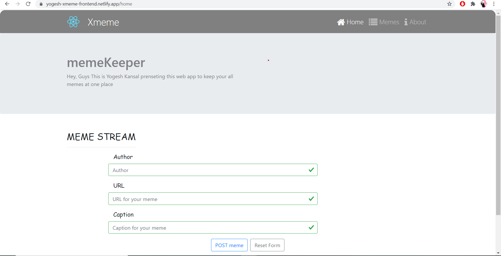
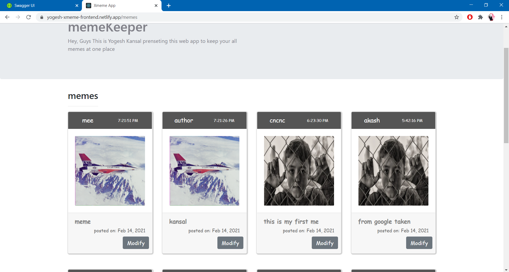
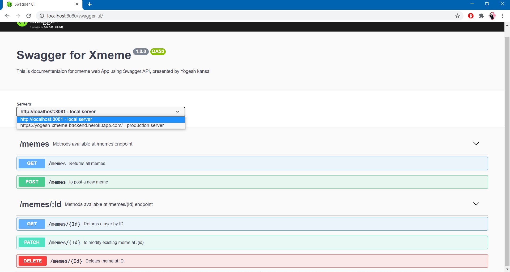

This is a FULL STACK web App implemeted using mern stack.

Front end of web app is implemented using REACT.
Code for same can be found in xmemefrontend folder of this repo.
react component are implemeted in /xmemefrontned/coponents folder.
It contains Header, Footer, About, RenderForm, Rendermemes, LodingSpinner subfolders containing js & cs ocdes.
FrontEnd is deployed using netlify web service.
Front end locally runs on:- http://localhost:3000/
production url for frontend is:- https://yogesh-xmeme-frontend.netlify.app/

Backend end of web app is implemented using node.js, express.js, mongoDB.
Code for same can be found in xmemefrontend folder of this repo.
Controllers folder contains memeController.js file for routes.
models folder contains model for memes
routes folder contains memeRuter & cors.js file.
Backendend locally runs on:- http://localhost:8081/
production url for backend is:- https://yogesh-xmeme-backend.herokuapp.com/

Home page of app

memes page of app

swagger UI documantaion

