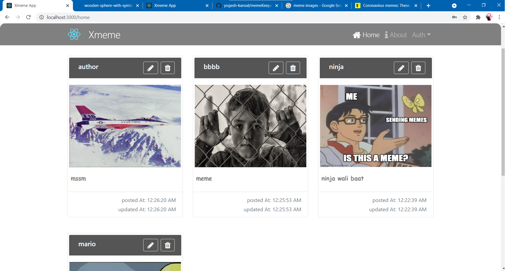

# Xmeme
`Xmeme` is a MERN stack web application where user of app can post their memes on plateform, It can be posted using link to photo or in file format. 
By default all memes will be posted publically. App provides functionality to user authentication. User can signup using Email Id and login by using same. after loggin user can see his/her posted meems, can modify his/her details and password. 
A user can modify memes or delete if user have posted perticular meme by his/her account. Publically posted memes cannot be modified or deleted. 
App supports JWT based authorization.
`more details about use are provided in repective folders.`
    
    - Frontend URL:- http://loclhost:3000
    - BAckend URL:- http://localhost:8081

## Technologies
- `HTML/CSS`, `Js`, `React.js` , `Bootstrap` for frontend implementation. 
- `Node.js`, `Express.js`, `Mongodb, `Mongoose` for backend implementation.

## Demo images
- Home

 
- Post New Meme

 
- User Profile

 
- Edit Profile

 
- Sign Up

 
- Login
